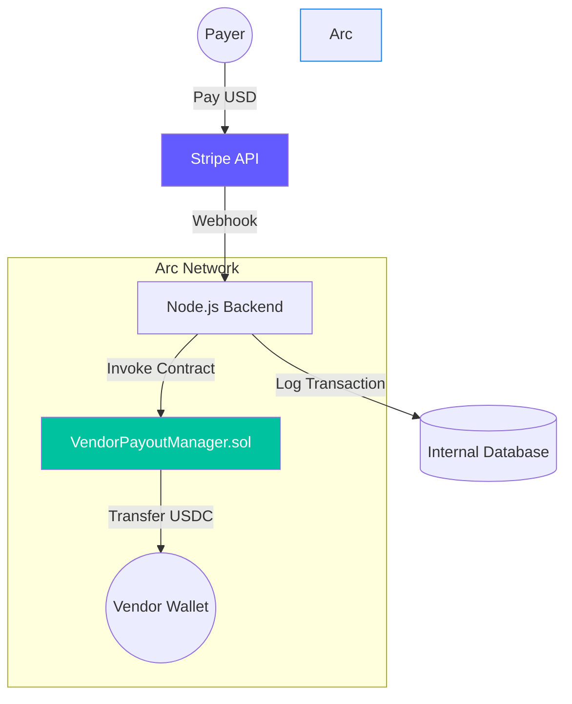

# Architecture Diagram

```mermaid
graph TD
    User((Payer)) -->|Pay USD| Stripe[Stripe API]
    Stripe -->|Webhook| Backend[Node.js Backend]
    
    subgraph "Arc Network"
        Backend -->|Invoke Contract| VPM[VendorPayoutManager.sol]
        VPM -->|Transfer USDC| Vendor((Vendor Wallet))
    end
    
    Backend -->|Log Transaction| DB[(Internal Database)]
    
    style Stripe fill:#635bff,color:#fff
    style Arc Network fill:#f0f4ff,stroke:#007bff
    style VPM fill:#01c29e,color:#fff
```
